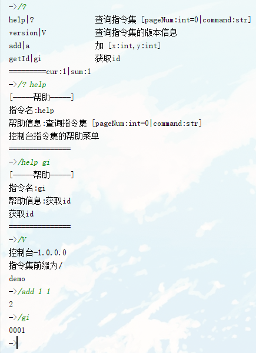
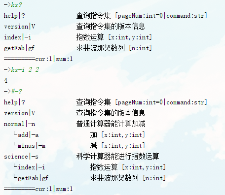

## Command Control [指令集管理控制]

### 优点

- 通过字典生成指令集方便处理指令之间的关系
- 自动生成指令集版本指令与帮助指令
- 帮助指令 按页查询、获取某个指令的详细信息、按树结构展示指令的关系
- 模糊匹配指令进行提示

### 参数介绍与要求

```python
class CommandControler:
    def __init__(self):
        '''
        :param commandDict: 指令集字典
        格式要求:
        {
            '指令名(ps:可通过|表示同义指令 示例-add|--a)': {
                'message': "指令信息 使用[{指令集前缀}?|help {该指令名}] 会得到该条信息",
                'helpMessage': "帮助信息 使用[{指令集前缀}?|help]时，该指令后方显示",
                'function': [调用该指令时执行的函数 详情见后],
                'childCommand': {子指令集字典，格式相同},
            },
        }
        function示例:
        def 函数名(
            param[该指令后方的切片字符串数组，已切割],
            (*args,**kwargs[doCommand方法指令字符串参数的后方参数不需要时设置为此])
            |(a,b,c[doCommand方法指令字符串参数的后方参数]))
        :param name: 指令集名
        :param prefix: 指令集识别前缀
        :param version: 指令集版本
        :param introduce: 指令集介绍
        '''
```

## 使用

- 最简单的一个示例

```python
# -*- coding: utf-8 -*-
from CommandControler import CommandControler

if __name__ == '__main__':
    # 最小实例
    demoCC = CommandControler(
        name="控制台",
        introduce="demo",
        commandDict={
            'add|a': {
                'message': "相加俩个值",
                'helpMessage': '加 [x:int,y:int]',
                'function':
                    lambda param,*args,**kwargs:\
                        (int(param[0]) + int(param[1])),
            },
            'getId|gi': {
                'message': "获取id",
                'helpMessage': '获取id',
                'function': lambda param,userId:userId,
            },
        })
    # 使用
    while True:
        inStr = input('->')
        resp = demoCC.doCommand(inStr, userId="0001")
        if resp != 'None': print(resp);continue
```



- 稍微复杂的一个示例

```python
# -*- coding: utf-8 -*-
from CommandControler import CommandControler

if __name__ == '__main__':
    def getFab(param,*args,**kwargs):
        def fab(number):
            if number==1 or number==2:
                return 1
            else:
                return fab(number-1)+fab(number-2)
        return fab(int(param[0]))
    normal_countCommandDict = {
        'add|-a': {
            'message': "相加俩个值",
            'helpMessage': '加 [x:int,y:int]',
            'function':
                lambda param,*args,**kwargs:\
                    (int(param[0]) + int(param[1])),
        },
        'minus|-m': {
            'message': "相减俩个值",
            'helpMessage': '减 [x:int,y:int]',
            'function':
                lambda param,*args,**kwargs:\
                    (int(param[0]) - int(param[1])),
        },}
    science_countCommandDict = {
        'index|-i': {
            'message': "求一个数的指数",
            'helpMessage': '指数运算 [x:int,y:int]',
            'function':
                lambda param,*args,**kwargs:\
                    pow(int(param[0]),int(param[1])),
        },
        'getFab|gf': {
            'message': "求斐波那契数列第n项",
            'helpMessage': '求斐波那契数列 [n:int]',
            'function': getFab,
        },}
    countCommandDict = {
        'normal|-n': {
            'message': "普通计算器",
            'helpMessage': '普通计算器能计算加减',
            'function':lambda param,*args,**kwargs:"一个普通计算器",
            'childCommand':normal_countCommandDict,
        },
        'science|-s': {
            'message': "科学计算器",
            'helpMessage': '科学计算器能进行指数运算',
            'function':lambda param,*args,**kwargs:"一个科学计算器",
            'childCommand':science_countCommandDict,
        },
    }
    # 实例0
    countCC = CommandControler(
        name="计算器",prefix="#-",version="1.0.0",
        introduce="一个通过指令控制的计算器",
        commandDict=countCommandDict)
    # 实例1
    scienceCC = CommandControler(
        name="科学计算器",prefix="kx",version="1.0.0",
        introduce="科学计算器",
        commandDict=science_countCommandDict)
    # 使用
    while True:
        inStr = input('->')
        resp = countCC.doCommand(inStr)
        if resp != 'None': print(resp);continue
        resp = scienceCC.doCommand(inStr)
        if resp != 'None': print(resp);continue
```

